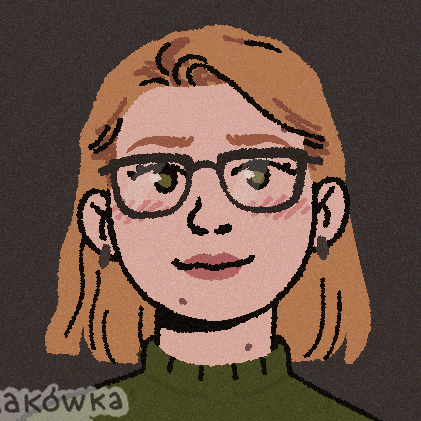

# Kate Prior

> *née Kathryn Loesel* · Digital Humanities scholar, educator, and media researcher

📍 Orlando, Florida · ✉️ [ka118757@ucf.edu](mailto:ka118757@ucf.edu)

  

This repository is the source for **[thekateprior.github.io](https://thekateprior.github.io/)**,
a single-page Digital Humanities portfolio served by GitHub Pages (Jekyll). The
page itself lives in `index.html`; styling is in `assets/css/style.css`, and the
pastel palette is drawn from the illustrated portrait above.

---

## About

I am a doctoral candidate in **Texts and Technology: Digital Humanities** at the
University of Central Florida, where my work sits at the intersection of fan
studies, media criticism, and digital culture. My research explores how fan
communities perceive, remix, and negotiate meaning around adaptations of
beloved characters — from Superman to Spider-Man — and how those perceptions
speak to broader questions of authorship, identity, and industry practice.

Alongside my scholarship, I am a dedicated, learning-centered educator. I have
taught for eight semesters across UCF's Department of English and Games and
Interactive Media in face-to-face, hybrid, and online formats, and in 2026 I
was honored with UCF's **Excellence in Graduate Student Teaching Award**.

---

## Education

| Degree | Field | Institution | Date |
| --- | --- | --- | --- |
| **Ph.D.** *(forthcoming)* | Texts and Technology: Digital Humanities | University of Central Florida | Anticipated Aug 2027 |
| **M.A.** | Film Theory and Criticism | Central Michigan University | May 2021 |
| **B.A.A.** | Broadcast and Cinematic Arts | Central Michigan University | May 2018 |

**Dissertation** — *"Your Choices, Your Actions: Fan Perceptions of Superman
Adaptations, Communities, and Industry Practices."*

---

## Experience

- **Graduate Teaching Associate**, Department of English — *University of Central Florida* · 2025–2026
- **Graduate Research Associate**, Veterans Legacy Program (Federal VA / National Cemetery Administration grant, Dept. of History) — *University of Central Florida* · 2023–Present
- **Graduate Teaching Associate**, Games and Interactive Media — *University of Central Florida* · 2022–2024
- **Graduate Research Associate**, Center for Humanities and Digital Research — *University of Central Florida* · 2022–2023
- **Student Lab Instructor**, School of Broadcast and Cinematic Arts — *Central Michigan University* · 2019–2021

---

## Teaching

**University of Central Florida**
- `DIG2000` Introduction to Digital Media
- `DIG2030` Digital Video Fundamentals
- `DIG3024` Digital Cultures and Narratives
- `ENC4415` Digital Rhetorics and the Modern Dialectic

**Central Michigan University**
- `BCA223` Introduction to Video Production

---

## Publications

- Prior, Kate. 2025. "Daddy Issues/Daddy Kink: Remixing Masculine Authority in
  Spider-Man Fan Fiction." *Transformative Works and Cultures*, no. 45.
  [doi.org/10.3983/twc.2025.2673](https://doi.org/10.3983/twc.2025.2673)

---

## Conferences

**International**
- Prior, Kate. 2025. "Who's White Baby is That: The Reproduction of Damian Wayne." *Console-ing Passions Conference*, Atlanta, GA.
- Prior, Kate. 2024. "He's So Babygirl: Fans' Perceptions of Superman in *My Adventures with Superman*." *Fan Studies Network North America Conference*, Online.
- Loesel, Kathryn. 2023. "The Hierarchy of Power is Changing: James Gunn and the Rebirth of DC Studios." *Fan Studies Network North America Conference*, Online.
- Loesel, Kathryn. 2023. "Will They or Won't They: Queerbaiting and Authorial Intent in *Sherlock* and *Hannibal*." *Society for Cinema and Media Studies Conference*, Denver, CO.

**Regional**
- Prior, Kate, Sarah Bousfield, and James Stoddard. 2024. "Community, Collaboration, and Commemoration: Veterans of the Global War on Terror." *Digitorium*, University of Alabama, Online.

---

## Awards & Professional Development

- **2026** — Excellence in Graduate Student Teaching Award, College of Arts and Humanities, University of Central Florida.
- **2026** *(forthcoming)* — Building a Digital Humanities Generative AI Learning Community: redesigning a UCF course to integrate AI literacy. Federal grant through the National Endowment for the Humanities.

---

## Teaching Philosophy

I design my courses around diverse learning strategies that meet students where
they are. I draw on formative and summative assessment to monitor and support
student progress, and I intentionally build inclusion into curriculum design so
that student diversity enriches — rather than merely coexists within — the
learning environment. My scholarship keeps me current in my discipline and
grounds my pedagogy in the scholarship of teaching and learning.

---

## Documents

- 📄 [Curriculum Vitae (PDF)](Prior%202026%20CV.pdf)
- ✉️ [Cover Letter (PDF)](PriorCL_VC.pdf)

---

<em>The illustrated portrait above is by akówka.</em>

